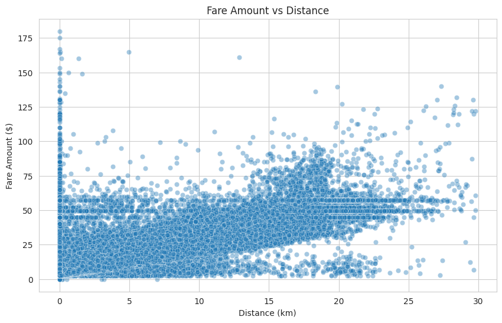
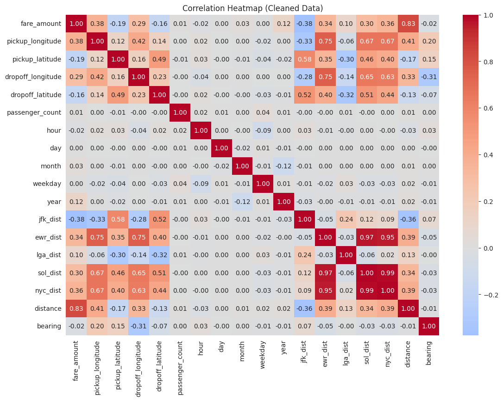
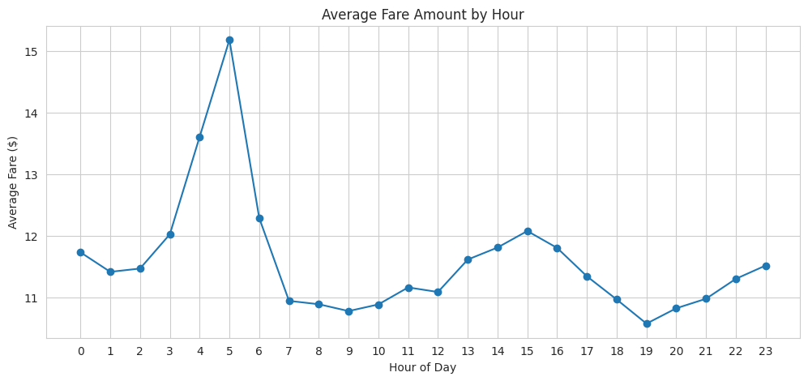
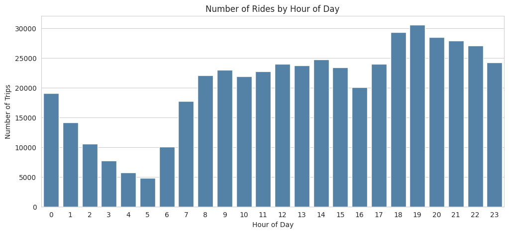
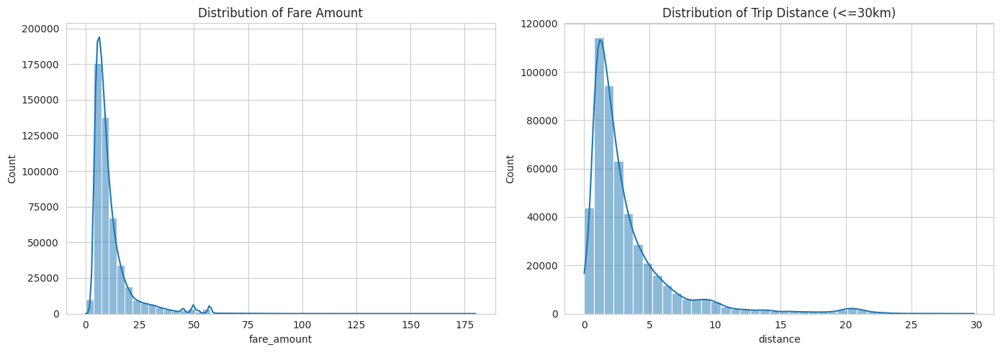

# 🚕 Uber Fare Prediction — Exploratory Data Analysis

**ML Internship Program · Cellula Technologies · Task 1**

Exploratory analysis of real NYC Uber ride records — cleaning the data, asking targeted questions, choosing the right plot for each one, and turning the results into insights that guide the fare-prediction model in Task 2.


---

## 📌 Overview

Before building any model, you need to deeply understand the data. This project explores an NYC Uber ride dataset to answer 10 questions about what actually drives the fare — then summarizes the findings into a set of insights that shape the next modeling step.

**Dataset:** ~real Uber NYC trip records, including fare, pickup/dropoff coordinates, timestamps, weather, traffic, car condition, and distances to major airports.

---

## 🧹 Data Cleaning

| Step | Why |
|---|---|
| Removed negative fares & zero-passenger trips | Not physically possible |
| Converted coordinates from radians → degrees | Raw values weren't geographically valid |
| Removed invalid GPS points & out-of-NYC coordinates | Data-entry / GPS errors |
| Capped extreme distances (>100km) and fares (>$180) | Clear outliers unsupported by the trip data |
| Converted `pickup_datetime` to proper datetime | Needed to extract hour/day/month correctly |

No missing values or duplicate rows were found — the issues were all outlier-driven.

---

## 🔍 Key Insights

### Distance is the strongest predictor of fare
Fare rises steadily and consistently with distance — a clear, strong linear relationship.



### Confirmed by the correlation heatmap
`distance` correlates with `fare_amount` at **~0.83** — far above any other feature.



### Fare vs. demand tell different stories by hour
Average **fare** rises slightly during early-morning and evening rush hours (longer trips)...



...while ride **demand** peaks in the evening and drops sharply overnight.



### Fare and distance are both right-skewed
Most trips are short and cheap, with a long tail of longer, pricier rides — relevant for model choice in Task 2.



### Weak individual effects
Passenger count, car condition, traffic level, weather, weekday, and month all showed little to no standalone effect on fare — pricing appears to follow a fixed distance/time model rather than trip conditions.

### Airport trips behave differently
Distance to JFK / EWR / LGA shows only a weak correlation with fare, likely because airport rides use flat-rate pricing instead of the usual distance-based model — worth engineering as a separate feature in Task 2.

---

## 📊 Full Question List

| # | Question | Plot Used |
|---|---|---|
| Q1 | Does passenger count affect fare? | Scatter + Boxplot |
| Q2 | Does car condition affect fare? | Boxplot |
| Q3 | What hour has the highest fares? | Line Chart |
| Q4 | Does traffic affect fare? | Boxplot |
| Q5 | Is distance the strongest predictor of fare? | Scatter Plot |
| Q6 | What hour has the most ride requests? | Count Plot |
| Q7 | Does weather affect trip distance? | Boxplot |
| Q8 | Are airport-adjacent rides pricier? | Scatter Plot |
| Q9 *(extra)* | Does day of week affect fare? | Boxplot |
| Q10 *(extra)* | Does month affect fare? | Line Chart |

Full code, plot-choice reasoning, and interpretation for every question is in the notebook.

---

## 📁 Repository Contents

```
├── task1_eda.ipynb          # Full EDA notebook (cleaning, all 10 questions, heatmap)
├── Uber_EDA_Task1.pptx      # Presentation: question → plot → insight, as a story
├── images/                  # Charts referenced in this README
└── README.md
```

## 🛠️ Tech Stack
`Python` · `Pandas` · `NumPy` · `Matplotlib` · `Seaborn`

## 🚀 Next Step
These findings feed directly into **Task 2**: `distance` will be the core feature, with additional engineering planned for airport trips and rush-hour periods.
